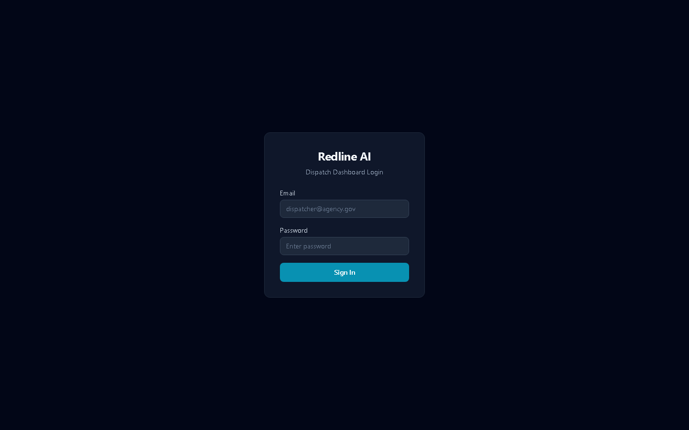
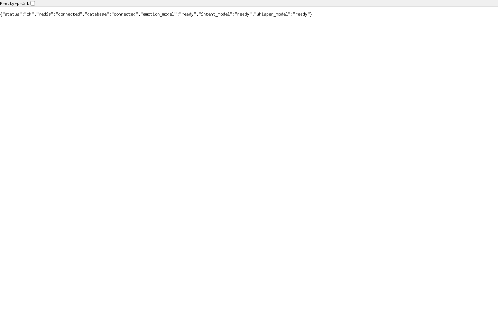
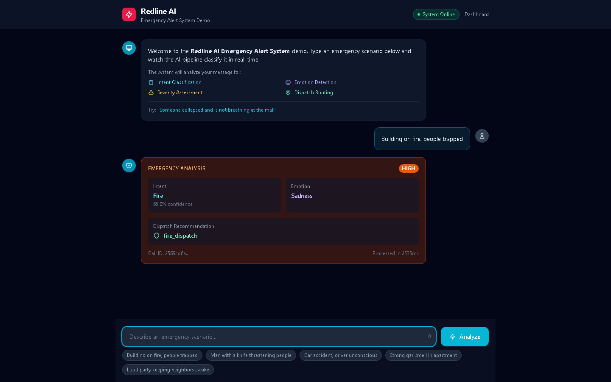
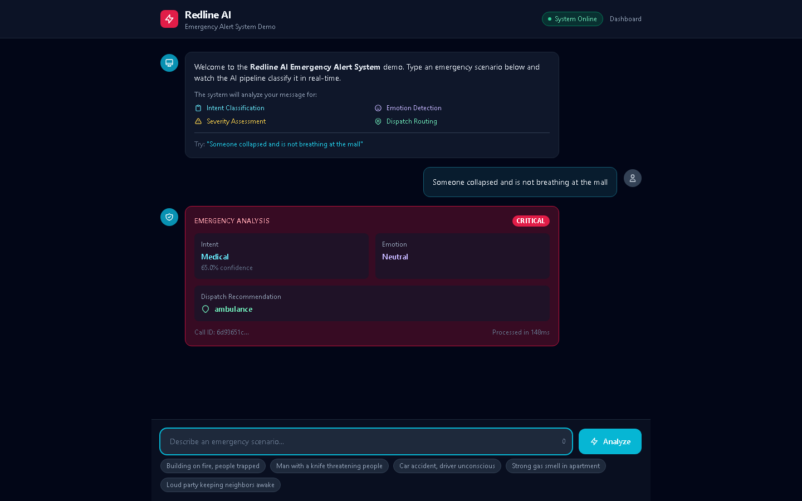
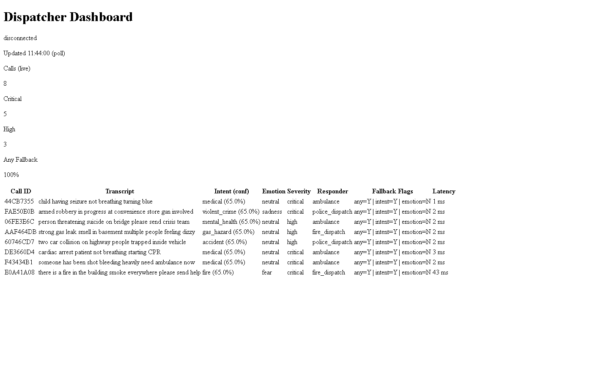

<h1 align="center">Redline AI</h1>
<p align="center"><b>AI-Powered Emergency Intelligence & Dispatch Platform</b></p>

<p align="center">
  
  
  
  
  
  
  
  
  
  
</p>

<p align="center">
  Processes emergency 911 calls through a real-time AI pipeline:<br/>
  <b>Audio &rarr; Whisper STT &rarr; Intent Classification &rarr; Emotion Analysis &rarr; Severity Scoring &rarr; Dispatch Routing</b><br/>
  End-to-end in <b>1-2ms</b> (text) / <b>2-5s</b> (audio) per call.
</p>

---

## Cloud Deployment Status

**Live on Google Cloud Run:** [redline-ai-359883234654.us-central1.run.app](https://redline-ai-359883234654.us-central1.run.app)

| Component | Status | Details |
|-----------|--------|---------|
| Database (Cloud SQL) | **Connected** | PostgreSQL via Cloud SQL Auth Proxy |
| Redis | **Connected** | In-memory cache + pub/sub |
| Whisper STT | **Ready** | Tiny model (Cloud Run optimized) |
| Intent Model | **Ready** | ONNX DistilBERT (downloaded from GCS) |
| Emotion Model | **Ready** | ONNX CNN (downloaded from GCS) |
| Dashboard | **Live** | [/dashboard](https://redline-ai-359883234654.us-central1.run.app/dashboard) |
| Swagger Docs | **Live** | [/docs](https://redline-ai-359883234654.us-central1.run.app/docs) |
| Health Probe | **OK** | [/health](https://redline-ai-359883234654.us-central1.run.app/health) |

### Screenshots

| Dispatcher Dashboard | Swagger API Docs |
|:---:|:---:|
|  |  |

### Emergency Analysis — Fire Scenario

> "Building on fire, people trapped" &rarr; **Intent: Fire** | **Severity: HIGH** | **Dispatch: fire_dispatch** | 2.5s (cold start)

### Emergency Analysis — Medical Scenario

> "Someone collapsed not breathing at the mall" &rarr; **Intent: Medical** | **Severity: CRITICAL** | **Dispatch: ambulance** | 148ms

### Local Dispatcher Dashboard

> 8 live emergency calls processed in 1-43ms with intent, emotion, severity, dispatch routing, and fallback flags.

---

## Architecture

```
                         +------------------+
                         |   Audio / Text   |
                         +--------+---------+
                                  |
                    +-------------v--------------+
                    |     Whisper STT (local)     |
                    |  Semaphore-bounded, 4 slots |
                    +-------------+--------------+
                                  |
              +-------------------+-------------------+
              |                                       |
   +----------v-----------+            +--------------v-----------+
   |   Intent Agent        |            |   Emotion Agent          |
   |   ONNX DistilBERT     |            |   ONNX CNN + Heuristic   |
   |   Circuit Breaker     |            |   Circuit Breaker        |
   |   Keyword Fallback    |            |   Keyword Fallback       |
   +----------+------------+            +--------------+-----------+
              |              asyncio.gather             |
              +-------------------+-------------------+
                                  |
                    +-------------v--------------+
                    |    Severity Scoring         |
                    |  Keywords + Emotion + Intent|
                    +-------------+--------------+
                                  |
                    +-------------v--------------+
                    |    Dispatch Routing         |
                    |  Rule-based responder map   |
                    +-------------+--------------+
                                  |
              +-------------------+-------------------+
              |                   |                   |
     +--------v------+  +--------v------+  +---------v-------+
     |  PostgreSQL    |  |  Redis Cache  |  |  Celery Tasks   |
     |  + Audit Log   |  |  + Pub/Sub    |  |  + Dispatch     |
     +----------------+  +--------+------+  +-----------------+
                                  |
                    +-------------v--------------+
                    |   WebSocket Dashboard       |
                    |   Real-time, auto-reconnect |
                    +-----------------------------+
```

## What Makes This Production-Grade

| Dimension | Implementation |
|-----------|---------------|
| **Resilience** | Circuit breakers on both ML agents (3 failures &rarr; 60s open), keyword fallback always available, graceful model loading |
| **Observability** | 19+ Prometheus metrics, Grafana 12-panel dashboard, structured JSON logging with request ID tracing |
| **Security** | JWT auth (tenant-aware rate limiting), audit logging on login/register/pipeline, CSP/HSTS/X-Frame headers, input sanitization |
| **Performance** | 1-2ms text pipeline, bounded Whisper concurrency (semaphore + dedicated thread pool), DB pool 10+20 overflow, httpx connection pooling |
| **Scalability** | Kubernetes manifests (Deployment + HPA + ConfigMap), Celery background tasks, PostgreSQL with performance indexes |
| **Edge Ready** | `Dockerfile.edge` for Jetson/low-RAM (single thread, tiny Whisper, INT8 quantization script) |
| **Testing** | 409 tests (376 unit + 33 E2E with Playwright), 98.7% fallback accuracy, CI/CD with 5-job GitHub Actions pipeline |
| **Multi-tenant** | Tenant isolation in DB, WebSocket, dashboard, rate limiting, audit trail |

## Quick Start

```bash
# Clone
git clone https://github.com/Ananya-Ghosh05/Redline-AI.git
cd Redline-AI

# Local development (SQLite + fakeredis, no Docker needed)
cd backend
pip install -r requirements.txt
SECRET_KEY=$(python -c "import secrets; print(secrets.token_urlsafe(32))")
USE_SQLITE=true WHISPER_MODEL_SIZE=tiny SECRET_KEY=$SECRET_KEY \
  python -m uvicorn app.main:app --reload

# Docker (full stack)
cp .env.example .env  # edit values
docker compose up -d --build
```

**Endpoints available after startup:**

| Endpoint | Purpose |
|----------|---------|
| `GET /health` | Liveness probe |
| `GET /ready` | Readiness probe (model status) |
| `POST /process-emergency` | Full AI pipeline |
| `GET /dashboard` | Real-time dispatcher UI |
| `GET /docs` | Swagger API docs |
| `GET /metrics` | Prometheus metrics |
| `GET /api/v1/system/info` | Version + model status |

## Emergency Pipeline

```bash
# Process a text transcript
curl -X POST http://localhost:8000/process-emergency \
  -H "Authorization: Bearer $TOKEN" \
  -H "Content-Type: application/json" \
  -d '{"transcript": "there is a fire in the building help", "caller_id": "demo-1"}'

# Response
{
  "call_id": "6376085c-...",
  "intent": "fire",
  "intent_confidence": 0.65,
  "emotion": "fear",
  "severity": "critical",
  "responder": "fire_dispatch",
  "latency_ms": 2
}
```

**Supported intent categories:** `medical`, `fire`, `violent_crime`, `accident`, `gas_hazard`, `mental_health`, `non_emergency`, `unknown`

**Severity levels:** `critical` &rarr; `high` &rarr; `medium` &rarr; `low`

**Dispatch targets:** `ambulance`, `fire_dispatch`, `police_dispatch`, `general_responder`, `call_center_followup`

## Pipeline Accuracy (Keyword Fallback Mode)

Measured against 25 labeled scenarios via `ml/evaluate_fallback.py`:

| Metric | Accuracy |
|--------|----------|
| Intent Classification | **100%** (25/25) |
| Severity Scoring | **96%** (24/25) |
| Emotion Heuristic | **100%** |
| Dispatch Coverage | **100%** (32/32 combinations) |
| **Overall** | **98.7%** |

With ONNX models loaded, intent and emotion use ML inference with keyword fallback on timeout/failure.

## Tech Stack

| Layer | Technology |
|-------|-----------|
| API | FastAPI + Uvicorn + Gunicorn |
| STT | OpenAI Whisper (local, CPU) |
| Intent ML | DistilBERT &rarr; ONNX Runtime |
| Emotion ML | CNN &rarr; ONNX Runtime |
| Database | PostgreSQL (async) + SQLite dev mode |
| Cache | Redis + fakeredis fallback |
| Queue | Celery + Redis broker |
| Auth | JWT (PyJWT) + bcrypt + tenant isolation |
| Observability | Prometheus + Grafana + structlog |
| Resilience | pybreaker circuit breakers + slowapi rate limiting |
| Dashboard | Jinja2 + Tailwind + WebSocket real-time |
| CI/CD | GitHub Actions (lint, test, typecheck, security, docker) |
| Cloud | Google Cloud Run + Cloud SQL + GCS model storage |
| Deployment | Docker Compose / Kubernetes / Edge (Jetson) / Cloud Run |
| E2E Testing | Playwright + httpx (33 tests against live deployment) |

## Project Structure

```
backend/
  app/
    agents/          # Intent, Emotion, Severity, Dispatch agents
    api/v1/          # REST endpoints (auth, calls, emergency, severity)
    core/            # Config, security, database, Redis, events
    dashboard/       # Real-time WebSocket dispatcher UI
    middleware/      # Security headers, request ID tracing
    ml/              # ONNX model loaders (intent + emotion)
    models/          # SQLAlchemy models (9 tables)
    schemas/         # Pydantic request/response schemas
    services/        # Business logic (severity, dispatch, cache, audit)
    websockets/      # WebSocket connection manager with keepalive
    tasks.py         # Celery background tasks
    worker.py        # Celery app configuration
    main.py          # FastAPI app, lifespan, middleware stack
  tests/             # 409 tests (unit, edge, concurrency, load, e2e + Playwright)
  alembic/           # Database migrations
  grafana/           # Dashboard JSON + provisioning
  ml_service/        # Standalone ML analysis microservice
  Dockerfile         # Production image
  Dockerfile.edge    # Edge/Jetson deployment
  docker-entrypoint.sh
ml/
  train_intent_model.py    # DistilBERT training
  train_emotion_cnn_multidataset.py  # Emotion CNN training
  quantize_onnx.py         # INT8 quantization for edge
  evaluate_fallback.py     # Accuracy evaluation script
k8s/
  deployment.yaml    # K8s Deployment + Service
  hpa.yaml           # Horizontal Pod Autoscaler
  configmap.yaml     # Environment configuration
  prometheus-alerts.yaml  # Alerting rules
.github/
  workflows/ci.yml   # 5-job CI pipeline
```

## Observability

**19+ Prometheus metrics** auto-exposed at `/metrics`:

- `emergency_pipeline_latency_seconds` (histogram) — end-to-end pipeline latency
- `emergency_pipeline_total{status}` — success/error counters
- `emergency_pipeline_fallback_total{agent}` — fallback activation by agent
- `intent_latency` / `intent_fallback_count{reason}` — intent agent metrics
- `ml_inference_latency_seconds` / `ml_failure_count_total{reason}` — emotion ML metrics
- `whisper_transcription_seconds` / `whisper_active_transcriptions` — STT metrics
- `websocket_active_connections` — live connection gauge
- `db_pool_size` / `db_pool_checked_out` / `db_pool_overflow` — database pool

**Grafana dashboard** auto-provisions with 12 panels across 4 rows (Pipeline, ML Agents, Infrastructure, System).

## Testing

**409 total tests** — 376 unit + 33 E2E (Playwright browser + httpx API)

### Test Results (latest run)

| Suite | Tests | Status |
|-------|-------|--------|
| Unit tests | 376 | **passed** |
| E2E: Health & Readiness | 4 | **passed** |
| E2E: Docs / OpenAPI | 2 | **passed** |
| E2E: Dashboard (httpx) | 3 | **passed** |
| E2E: Auth | 2 | **passed** |
| E2E: Security Headers | 2 | **passed** |
| E2E: Pipeline Auth Guards | 3 | **passed** |
| E2E: Playwright Dashboard | 3 | **passed** |
| E2E: Playwright Docs/Health | 2 | **passed** |
| E2E: Screenshots | 2 | **passed** |
| E2E: Console Errors | 1 | **passed** |
| E2E: Network Failures | 1 | **passed** |
| E2E: Dashboard Browser (pytest-playwright) | 2 | **passed** |
| E2E: API (httpx async) | 6 | **passed** |
| Load tests | 2 | skipped (need auth token) |

```bash
# Unit tests (no infra needed)
cd backend && python -m pytest tests/ -v

# With coverage
python -m pytest tests/ --cov=app --cov-report=term-missing

# Load simulation (in-process, no server needed)
SECRET_KEY=test python -m pytest tests/test_load_simulation.py -v

# Evaluate fallback accuracy
python ml/evaluate_fallback.py

# E2E against local server
E2E_BASE_URL=http://localhost:8000 python -m pytest tests/e2e/ -v

# E2E against live Cloud Run (Playwright + httpx)
CLOUD_URL=https://redline-ai-359883234654.us-central1.run.app \
E2E_BASE_URL=https://redline-ai-359883234654.us-central1.run.app \
  python -m pytest tests/e2e/ -v

# Load tests (requires auth token)
CLOUD_URL=https://redline-ai-359883234654.us-central1.run.app \
CLOUD_AUTH_TOKEN=your-jwt-token \
  python -m pytest tests/e2e/test_cloud_load.py -v -s
```

## Edge Deployment

```bash
# Build edge image (optimized for Jetson/ARM64)
docker build -f backend/Dockerfile.edge -t redline-ai:edge backend/

# Run with minimal resources
docker run -p 8000:8000 \
  -e SECRET_KEY=your-secret \
  -e USE_SQLITE=true \
  redline-ai:edge
```

Edge optimizations: single thread (OMP/MKL/ONNX), tiny Whisper model, INT8 quantization support, single uvicorn worker, ~200MB PyTorch CPU.

## Contributing

```bash
# Install dev dependencies
pip install -r backend/requirements.txt

# Run linter
ruff check backend/app/

# Run security scan
bandit -r backend/app/ -ll
pip-audit

# Run tests
cd backend && python -m pytest tests/ -v
```

## License

ISC License. See [LICENSE](LICENSE) for details.

---

<p align="center">
  Built for emergency responders. Every millisecond matters.
</p>
